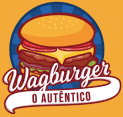

# WAGBURGER

# Descrição
Essa aplicação é um carrinho de compras de uma lanchonete fictícia chamada
Wagburger que utilizar React e hooks para gerenciar estados.

A aplicação é uma demonstração do meu conhecimento e prática em trabalhar com 
HTML, CSS, JavaScript e React! Utilizando conceitos como a Context API e Hooks.

Atenção! Esse é um projeto em andamento!
Até o presente momento a aplicação faz uso da API do MercadoLivre.
Futuramente, irei desenvolver e implementar minha própria aplicação do Wagburger. Assim como implementar novas funcionalidades, e otimizar funcionalidades já implementadas

# Tecnologias Utilizadas
* HTML
* CSS
* JavaScript
* React
* Context API
* Hooks
* Prop Types

# Funcionalidades
Listagem dos produtos recebidos via API
Adicionar e remover itens do carrinho de compras
Pesquisar por itens através da barra de pesquisa
Mais em breve...

# Como Executar
Faça o clone deste repositório.
Instale as dependências utilizando o comando npm install ou outro pacote.
Execute o comando npm start para iniciar a aplicação.
Acesse a aplicação no seu navegador através do endereço http://localhost:3000.

# Contribuição
Contribuições e sugestões são sempre bem-vindas! Sinta-se à vontade para enviar um pull request com melhorias, correções de bugs ou novas funcionalidades.

# Contato
Sinta-se à vontade para enviar um email para felipe.mbarbosa.dev@gmail.com
Confira também meu LinkedIn e vamos compartilhar expandir nossa NetWork juntos!
LinkedIn: https://www.linkedin.com/in/felipe-matos-vqv/

# Email: felipe.mbarbosa.dev@gmail.com
# LinkedIn: https://www.linkedin.com/in/felipe-matos-vqv/
# Obrigado por visitar este repositório!
